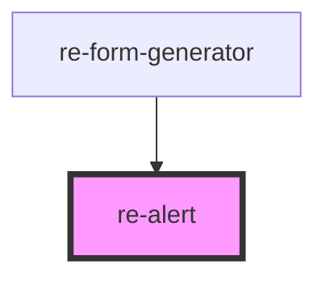

# re-alert

<!-- Auto Generated Below -->

## Properties

| Property  | Attribute | Description | Type                                          | Default     |
| --------- | --------- | ----------- | --------------------------------------------- | ----------- |
| `message` | `message` |             | `string`                                      | `undefined` |
| `type`    | `type`    |             | `"error" \| "info" \| "success" \| "warning"` | `'info'`    |

## Dependencies

### Used by

 - [re-form-generator](../re-form-generator)

### Graph

----------------------------------------------

*Built with [StencilJS](https://stenciljs.com/)*
