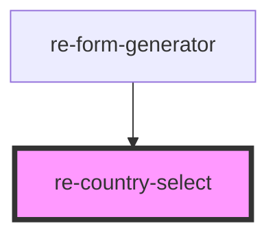

# re-country-select

<!-- Auto Generated Below -->

## Properties

| Property          | Attribute           | Description | Type      | Default     |
| ----------------- | ------------------- | ----------- | --------- | ----------- |
| `defaultValue`    | `default-value`     |             | `string`  | `undefined` |
| `disabled`        | `disabled`          |             | `any`     | `undefined` |
| `inputDisplayKey` | `input-display-key` |             | `string`  | `undefined` |
| `inputOptions`    | `input-options`     |             | `any`     | `undefined` |
| `modelKey`        | `model-key`         |             | `string`  | `undefined` |
| `showDialCode`    | `show-dial-code`    |             | `boolean` | `false`     |
| `zIndex`          | `z-index`           |             | `string`  | `undefined` |

## Events

| Event                    | Description | Type               |
| ------------------------ | ----------- | ------------------ |
| `selectedCountryChanged` |             | `CustomEvent<any>` |

## Dependencies

### Used by

 - [re-form-generator](../re-form-generator)

### Graph

----------------------------------------------

*Built with [StencilJS](https://stenciljs.com/)*
