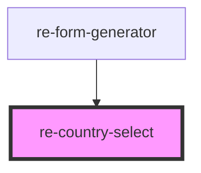

# re-country-select

<!-- Auto Generated Below -->

## Properties

| Property          | Attribute           | Description                                                                                             | Type       | Default        |
| ----------------- | ------------------- | ------------------------------------------------------------------------------------------------------- | ---------- | -------------- |
| `ariaLabelText`   | `aria-label-text`   | Read out by screen readers (the compact picker has no visible label).                                   | `string`   | `undefined`    |
| `compact`         | `compact`           | Small picker (flag and dial code) in front of a phone number: the list opens wider than the box.        | `boolean`  | `false`        |
| `defaultValue`    | `default-value`     |                                                                                                         | `string`   | `undefined`    |
| `disabled`        | `disabled`          |                                                                                                         | `any`      | `undefined`    |
| `inputDisplayKey` | `input-display-key` |                                                                                                         | `string`   | `undefined`    |
| `inputOptions`    | `input-options`     |                                                                                                         | `any`      | `undefined`    |
| `language`        | `language`          | Language used for the country names (via Intl.DisplayNames); the stored value (the code) never changes. | `string`   | `undefined`    |
| `modelKey`        | `model-key`         |                                                                                                         | `string`   | `undefined`    |
| `noResultsText`   | `no-results-text`   | Shown when the search matches nothing.                                                                  | `string`   | `'No results'` |
| `only`            | --                  | Only offer these countries (codes like "dk", "se"). Empty: all of them.                                 | `string[]` | `undefined`    |
| `showDialCode`    | `show-dial-code`    |                                                                                                         | `boolean`  | `false`        |
| `zIndex`          | `z-index`           |                                                                                                         | `string`   | `undefined`    |

## Events

| Event                    | Description | Type               |
| ------------------------ | ----------- | ------------------ |
| `selectedCountryChanged` |             | `CustomEvent<any>` |

## Dependencies

### Used by

 - [re-form-generator](../re-form-generator)

### Graph

```mermaid
graph TD;
  re-form-generator --> re-country-select
  style re-country-select fill:#f9f,stroke:#333,stroke-width:4px
```

----------------------------------------------

*Built with [StencilJS](https://stenciljs.com/)*
