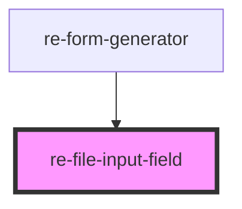

# re-file-input-field

<!-- Auto Generated Below -->

## Properties

| Property          | Attribute          | Description | Type     | Default     |
| ----------------- | ------------------ | ----------- | -------- | ----------- |
| `inputAttributes` | `input-attributes` |             | `any`    | `undefined` |
| `inputProps`      | `input-props`      |             | `any`    | `undefined` |
| `modelKey`        | `model-key`        |             | `string` | `undefined` |
| `placeholder`     | `placeholder`      |             | `string` | `undefined` |
| `subTitle`        | `sub-title`        |             | `string` | `undefined` |
| `textTitle`       | `text-title`       |             | `string` | `undefined` |

## Events

| Event                 | Description | Type               |
| --------------------- | ----------- | ------------------ |
| `selectedFileChanged` |             | `CustomEvent<any>` |

## Dependencies

### Used by

 - [re-form-generator](../re-form-generator)

### Graph

----------------------------------------------

*Built with [StencilJS](https://stenciljs.com/)*
