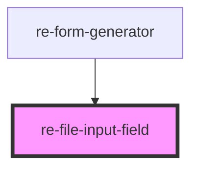

# re-file-input-field

<!-- Auto Generated Below -->

## Properties

| Property          | Attribute          | Description                                                                        | Type      | Default     |
| ----------------- | ------------------ | ---------------------------------------------------------------------------------- | --------- | ----------- |
| `compact`         | `compact`          | A small "add" button instead of the big drop area (use with `preview` for photos). | `boolean` | `false`     |
| `inputAttributes` | `input-attributes` |                                                                                    | `any`     | `undefined` |
| `inputProps`      | `input-props`      |                                                                                    | `any`     | `undefined` |
| `modelKey`        | `model-key`        |                                                                                    | `string`  | `undefined` |
| `placeholder`     | `placeholder`      |                                                                                    | `string`  | `undefined` |
| `preview`         | `preview`          | Show a thumbnail for every chosen image.                                           | `boolean` | `false`     |
| `subTitle`        | `sub-title`        |                                                                                    | `string`  | `undefined` |
| `textTitle`       | `text-title`       |                                                                                    | `string`  | `undefined` |

## Events

| Event                 | Description | Type               |
| --------------------- | ----------- | ------------------ |
| `selectedFileChanged` |             | `CustomEvent<any>` |

## Dependencies

### Used by

 - [re-form-generator](../re-form-generator)

### Graph

```mermaid
graph TD;
  re-form-generator --> re-file-input-field
  style re-file-input-field fill:#f9f,stroke:#333,stroke-width:4px
```

----------------------------------------------

*Built with [StencilJS](https://stenciljs.com/)*
