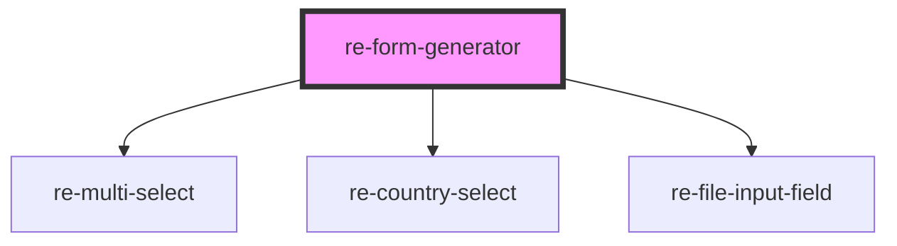

# re-form-generator

<!-- Auto Generated Below -->

## Properties

| Property  | Attribute | Description | Type     | Default     |
| --------- | --------- | ----------- | -------- | ----------- |
| `action`  | `action`  |             | `any`    | `{}`        |
| `formId`  | `form-id` |             | `string` | `undefined` |
| `mapping` | `mapping` |             | `any`    | `null`      |
| `model`   | `model`   |             | `any`    | `{}`        |
| `schema`  | `schema`  |             | `any`    | `[]`        |

## Events

| Event             | Description | Type               |
| ----------------- | ----------- | ------------------ |
| `handleSubmit`    |             | `CustomEvent<any>` |
| `submitted`       |             | `CustomEvent<any>` |
| `validationError` |             | `CustomEvent<any>` |
| `valueChanged`    |             | `CustomEvent<any>` |

## Methods

### `submit() => Promise<any>`

#### Returns

Type: `Promise<any>`

### `updateValue(key: any, value: any) => Promise<void>`

#### Parameters

| Name    | Type  | Description |
| ------- | ----- | ----------- |
| `key`   | `any` |             |
| `value` | `any` |             |

#### Returns

Type: `Promise<void>`

### `validate() => Promise<any>`

#### Returns

Type: `Promise<any>`

## Dependencies

### Depends on

- [re-multi-select](../re-multi-select)
- [re-country-select](../re-country-select)
- [re-file-input-field](../re-file-input-field)

### Graph

----------------------------------------------

*Built with [StencilJS](https://stenciljs.com/)*
