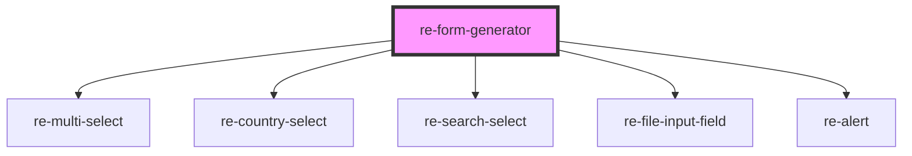

# re-form-generator

<!-- Auto Generated Below -->

## Properties

| Property     | Attribute     | Description                                                                                                                                                                                                    | Type      | Default     |
| ------------ | ------------- | -------------------------------------------------------------------------------------------------------------------------------------------------------------------------------------------------------------- | --------- | ----------- |
| `action`     | `action`      | Where to send the answers: { endpoint, httpMethod, bearerToken, headers, formData, recaptchaSiteKey, webhookEndpoint, mapping }. Overrides `schema.action`.                                                    | `any`     | `{}`        |
| `designMode` | `design-mode` | Used by the builder: shows every field, ignores logic and disables interaction.                                                                                                                                | `boolean` | `false`     |
| `formId`     | `form-id`     |                                                                                                                                                                                                                | `string`  | `undefined` |
| `language`   | `language`    | Forces a language (e.g. `es`, `pt-BR`), overriding browser detection and hiding the language switcher. Without it the language is picked from `schema.i18n` (browser language if available, else the default). | `string`  | `null`      |
| `mapping`    | `mapping`     | v1 compatibility: field mapping. Prefer `action.mapping`.                                                                                                                                                      | `any`     | `null`      |
| `model`      | `model`       | Initial values, keyed by field `model`.                                                                                                                                                                        | `any`     | `{}`        |
| `schema`     | `schema`      | The form definition: a v2 document, or a v1 array of fields (migrated automatically). Object or JSON string.                                                                                                   | `any`     | `[]`        |
| `theme`      | `theme`       | Theme object (or preset id / JSON string). Overrides `schema.theme`.                                                                                                                                           | `any`     | `null`      |

## Events

| Event             | Description                                                                                                          | Type                                 |
| ----------------- | -------------------------------------------------------------------------------------------------------------------- | ------------------------------------ |
| `handleSubmit`    |                                                                                                                      | `CustomEvent<any>`                   |
| `languageChanged` | Fires when the displayed language changes (detection on load, the switcher, `setLanguage()` or the `language` prop). | `CustomEvent<{ language: string; }>` |
| `submitted`       |                                                                                                                      | `CustomEvent<any>`                   |
| `validationError` |                                                                                                                      | `CustomEvent<any>`                   |
| `valueChanged`    |                                                                                                                      | `CustomEvent<any>`                   |

## Methods

### `getLanguage() => Promise<string>`

#### Returns

Type: `Promise<string>`

### `getValues() => Promise<{ [key: string]: any; }>`

#### Returns

Type: `Promise<{ [key: string]: any; }>`

### `reset() => Promise<void>`

#### Returns

Type: `Promise<void>`

### `setLanguage(language: string) => Promise<void>`

Switches the form to `language` (must be one of the document's languages, or a built-in one).

#### Parameters

| Name       | Type     | Description |
| ---------- | -------- | ----------- |
| `language` | `string` |             |

#### Returns

Type: `Promise<void>`

### `submit() => Promise<any>`

#### Returns

Type: `Promise<any>`

### `updateValue(key: string, value: any) => Promise<void>`

#### Parameters

| Name    | Type     | Description |
| ------- | -------- | ----------- |
| `key`   | `string` |             |
| `value` | `any`    |             |

#### Returns

Type: `Promise<void>`

### `validate() => Promise<{ [key: string]: string[]; }>`

#### Returns

Type: `Promise<{ [key: string]: string[]; }>`

## Dependencies

### Depends on

- [re-multi-select](../re-multi-select)
- [re-country-select](../re-country-select)
- [re-search-select](../re-search-select)
- [re-file-input-field](../re-file-input-field)
- [re-alert](../re-alert)

### Graph

```mermaid
graph TD;
  re-form-generator --> re-multi-select
  re-form-generator --> re-country-select
  re-form-generator --> re-search-select
  re-form-generator --> re-file-input-field
  re-form-generator --> re-alert
  style re-form-generator fill:#f9f,stroke:#333,stroke-width:4px
```

----------------------------------------------

*Built with [StencilJS](https://stenciljs.com/)*
