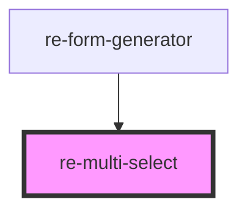

# re-multi-select

<!-- Auto Generated Below -->

## Properties

| Property         | Attribute         | Description | Type                               | Default     |
| ---------------- | ----------------- | ----------- | ---------------------------------- | ----------- |
| `defaultOptions` | `default-options` |             | `any`                              | `undefined` |
| `disabled`       | `disabled`        |             | `boolean`                          | `undefined` |
| `inputName`      | `input-name`      |             | `string`                           | `undefined` |
| `inputOptions`   | `input-options`   |             | `any`                              | `undefined` |
| `modelKey`       | `model-key`       |             | `string`                           | `undefined` |
| `options`        | --                |             | `{ value: any; label: string; }[]` | `undefined` |

## Events

| Event                     | Description | Type               |
| ------------------------- | ----------- | ------------------ |
| `multiSelectValueChanged` |             | `CustomEvent<any>` |

## Dependencies

### Used by

 - [re-form-generator](../re-form-generator)

### Graph

----------------------------------------------

*Built with [StencilJS](https://stenciljs.com/)*
