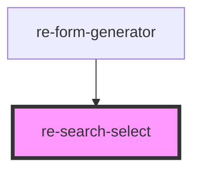

# re-search-select

<!-- Auto Generated Below -->

## Overview

Remote autocomplete. Type to search, pick from the results. With `multiple` the picks pile up as removable chips.
The form passes the endpoint in `source`:

  { url: 'https://api.example.com/search?q={q}', resultsPath: 'items', labelKey: 'name', valueKey: 'id',
    labelTemplate: '{street} {number}, {zip} {city|town}', minChars: 2, debounce: 250, headers: { Authorization: '…' } }

Step by step search (street -> number -> unit): `drill: { typeKey: 'type', expandTypes: ['vejnavn', 'adgangsadresse'] }`.
Results whose type is listed open the next level when picked (the box is filled with their text and searched again);
the others are final. `extraKey` shows a small note next to a result.

`labelTemplate` builds a shorter label from several fields: `{a.b}` is replaced by that path, `{a|b}` uses the first
one that has a value, and empty parts are dropped. Without it `labelKey` is used.

`{q}` in the URL is replaced with the typed text. Without `resultsPath` the response itself must be an array.

## Properties

| Property      | Attribute     | Description                                                                                                                                                                           | Type                         | Default     |
| ------------- | ------------- | ------------------------------------------------------------------------------------------------------------------------------------------------------------------------------------- | ---------------------------- | ----------- |
| `disabled`    | `disabled`    |                                                                                                                                                                                       | `boolean`                    | `false`     |
| `labelledBy`  | `labelled-by` | Id of the element that labels the input (aria-labelledby). A `<label for>` is avoided on purpose: Chrome reads such labels ("Address") and pops up its saved addresses over our list. | `string`                     | `undefined` |
| `modelKey`    | `model-key`   |                                                                                                                                                                                       | `string`                     | `undefined` |
| `multiple`    | `multiple`    |                                                                                                                                                                                       | `boolean`                    | `false`     |
| `placeholder` | `placeholder` |                                                                                                                                                                                       | `string`                     | `undefined` |
| `selected`    | --            | The current selection, owned by the form.                                                                                                                                             | `SearchItem[]`               | `[]`        |
| `source`      | `source`      |                                                                                                                                                                                       | `any`                        | `undefined` |
| `texts`       | --            | Localized texts: { searching, noResults, remove }.                                                                                                                                    | `{ [key: string]: string; }` | `{}`        |

## Events

| Event                | Description | Type                                              |
| -------------------- | ----------- | ------------------------------------------------- |
| `searchValueChanged` |             | `CustomEvent<{ [model: string]: SearchItem[]; }>` |

## Dependencies

### Used by

 - [re-form-generator](../re-form-generator)

### Graph

----------------------------------------------

*Built with [StencilJS](https://stenciljs.com/)*
