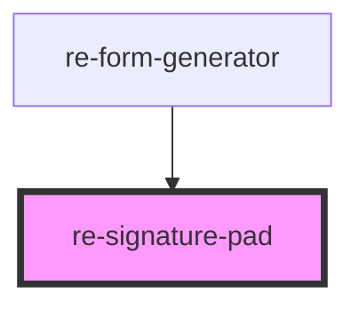

# re-signature-pad

<!-- Auto Generated Below -->

## Overview

A box to sign in with a finger, pen or mouse. The answer is the signature as a PNG data URL (empty when cleared).

## Properties

| Property   | Attribute   | Description                                         | Type                                 | Default     |
| ---------- | ----------- | --------------------------------------------------- | ------------------------------------ | ----------- |
| `disabled` | `disabled`  |                                                     | `boolean`                            | `false`     |
| `height`   | `height`    | Height of the box in pixels.                        | `number`                             | `160`       |
| `modelKey` | `model-key` | The answer key the form stores the signature under. | `string`                             | `undefined` |
| `texts`    | --          |                                                     | `{ hint?: string; clear?: string; }` | `{}`        |
| `value`    | `value`     | The current signature (PNG data URL), or empty.     | `string`                             | `''`        |

## Events

| Event              | Description | Type               |
| ------------------ | ----------- | ------------------ |
| `signatureChanged` |             | `CustomEvent<any>` |

## Dependencies

### Used by

 - [re-form-generator](../re-form-generator)

### Graph

----------------------------------------------

*Built with [StencilJS](https://stenciljs.com/)*
